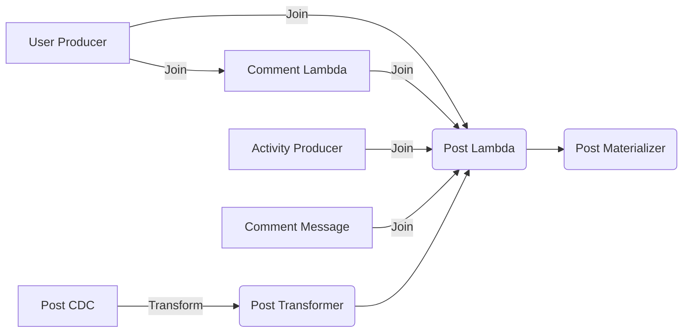

# Spring Cloud Stream Example

An example for spring cloud stream implementation on a social media application.

```mermaid
graph LR
    A[User Producer] -->|Join| B(Post Lambda)
    A[User Producer] -->|Join| C(Comment Lambda)
    G[Post CDC] --> |Transform| F(Post Transformer) --> B(Post Lambda)

    C[Comment Lambda] -->|Join| B(Post Lambda)
    D[Activity Producer] -->|Join| B(Post Lambda)

    E[Comment Message] -->|Join| B(Post Lambda)

    B(Post Lambda)--> H(Post Materializer)
```