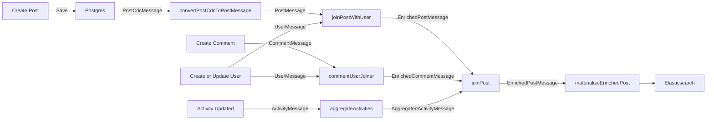

# Twitt

An example for spring cloud stream implementation on post application.
This project using an event-driven architecture that will do stateful
operation instead of stateless operation, e.g. HTTP call.

By implementing this architecture, it will include all log changes into kafka as the
data source instead of relying on other service/database.

## General Architecture
Here is a flow of how the data stream works from capturing changes from database to combined and saved to other
database.

CDC will capture all the changes on `posts` table and will be materialized by debezium into kafka event
that can be consumed. Then all the join process will be stored on persistent key-value database,
if there's any new message then it will trigger the join operation.   

For instance on `joinPost` operation if there's any update user which trigger UserMessage to be produced, it will trigger
`joinPost` operation that will join to user KTable and update the user with the latest value.

## How to run
### Prerequisite
1. Docker compose
2. Gradle 
3. Kotlin
4. Java 11

### Running
1. Run all the external dependencies by running `docker-compose up -d` and make sure all the containers are ready
2. Install all the dependencies on gradle and make sure the build is successful by running `./gradlew build`
3. Run with profile `fn-twitt-lambdas` by using command `./gradlew bootRun --args='--spring.profiles.active=fn-twitt-lambdas'`
4. You will be able to connect to elasticsearch on `http://localhost:9200/posts` and postgres on `jdbc:postgresql://localhost:5432/twitt`
5. Have fun :)
